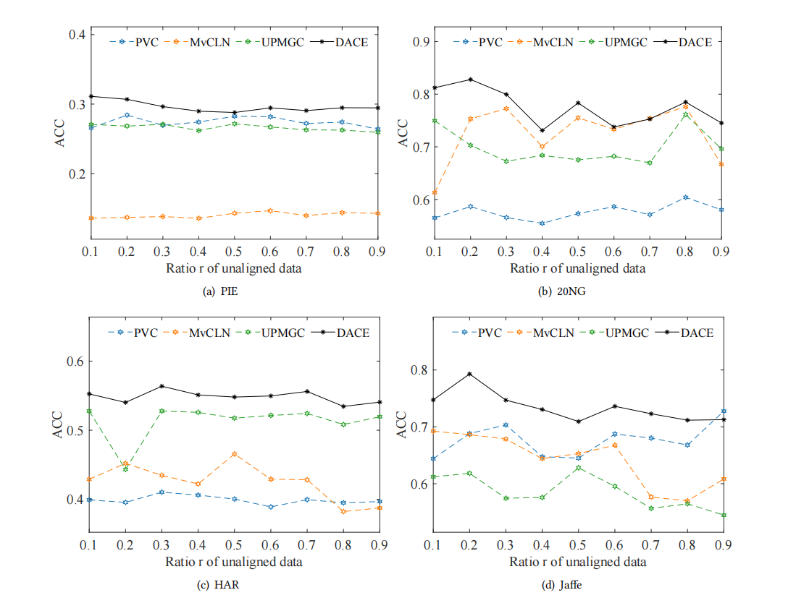
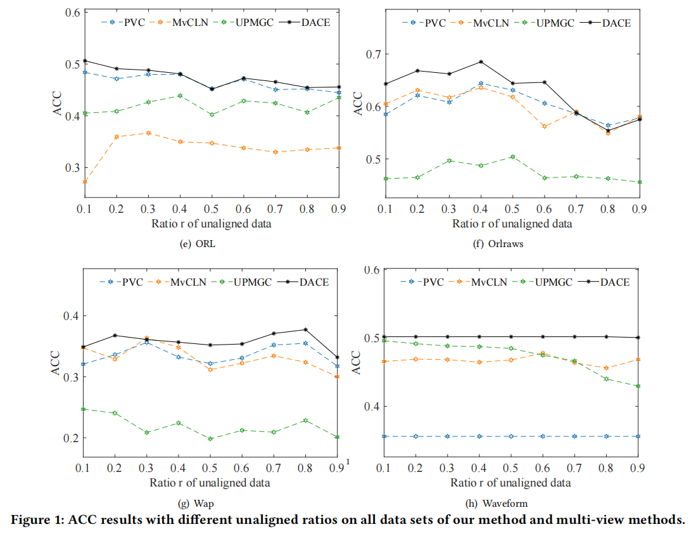
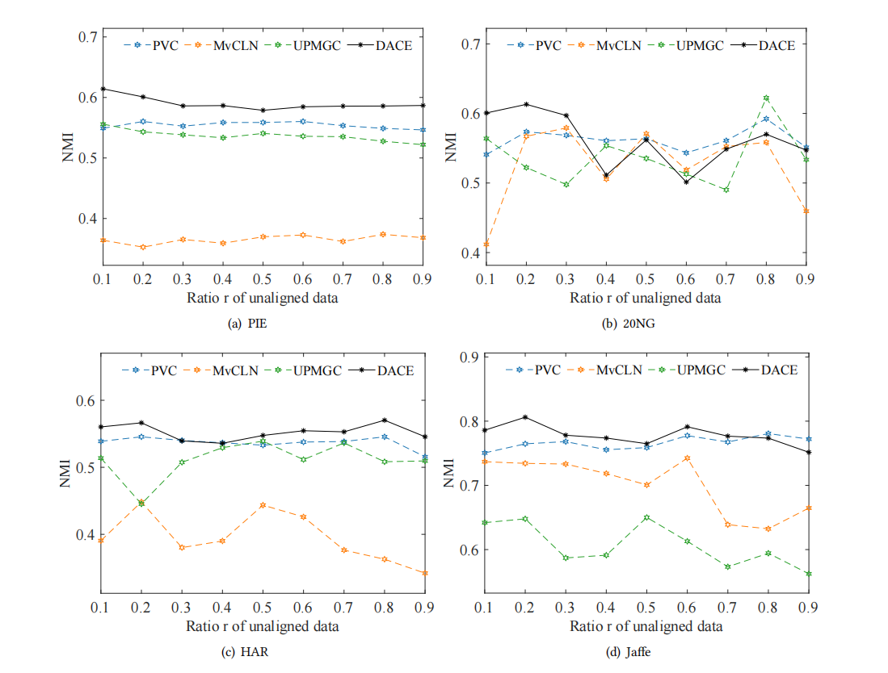
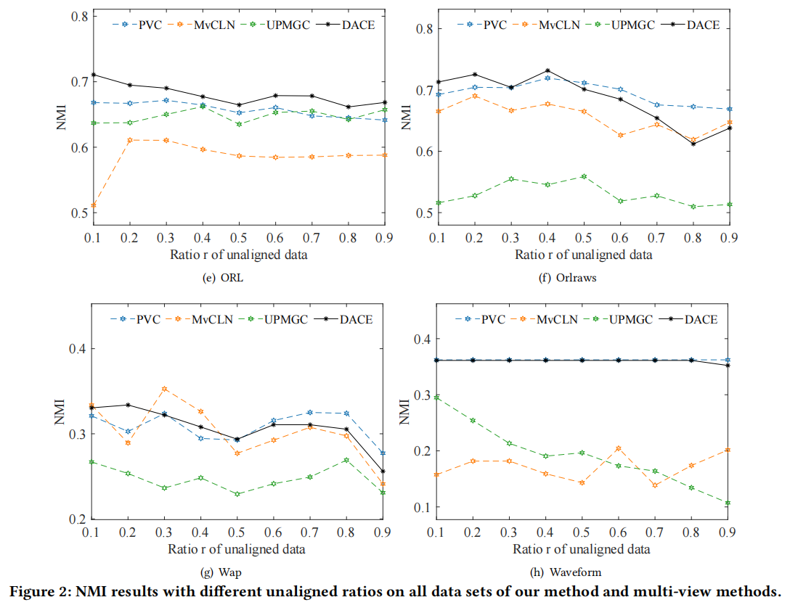

**Q3 of Reviewer EzF8**

Partially aligned multi-view clustering is still underexplored and only few works are proposed. Most existing partially aligned multi-view clustering methods can only handle data with two views, which means can only handle two base results. To the best of our knowledge, we only find UPMGC, which can handle data with more than two views (or base clusterings). That is why we only compared with this method. As you suggested, we now also compare with two additional partially aligned multi-view clustering methods PVC and MvCLN. Since these two methods can only handle two views, we generate two base clustering results for ensemble. We show the results in "Anonymous.pdf". We can see that, this case containing only two base results is easier than our setting that ensembles 10 base results, because the performance of  these methods decrease slower than in the case to ensemble 10 base results. Despite this, our method can still perform better than these multi-view methods.

If you can't open the "Anonymous.pdf" online, please download it and open it to view, thank you!

